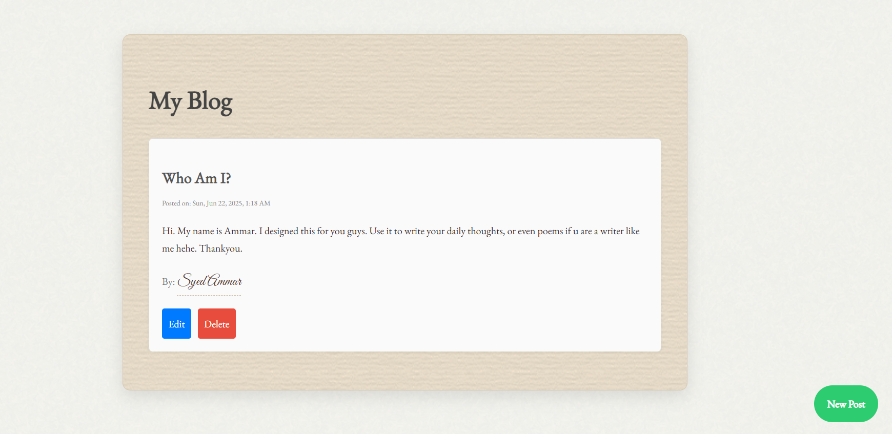
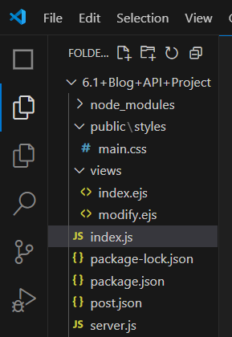
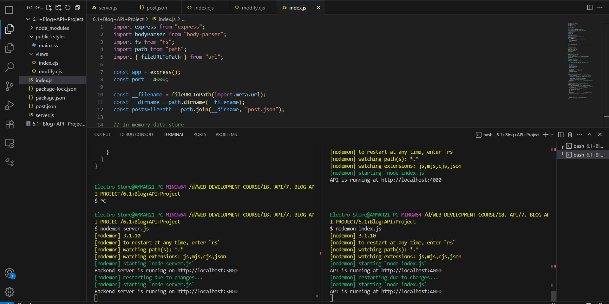
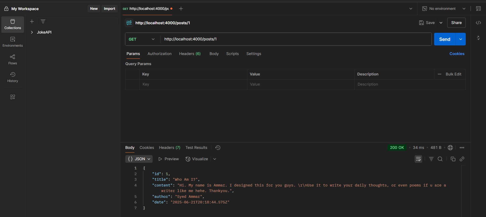
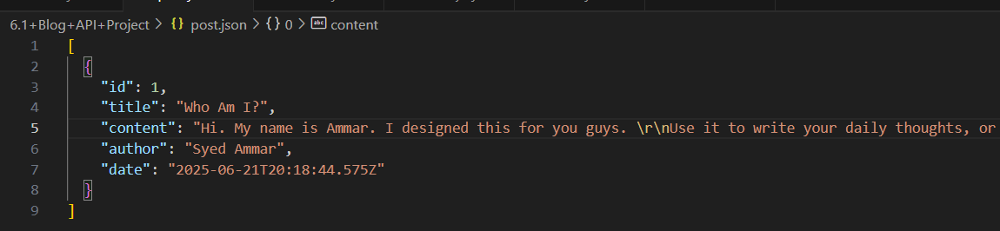

# 🖋️ My Blog

A vintage-styled blogging platform built for writers who love aesthetics, simplicity, and timeless writing experiences.

 

---

## ✨ Features

- 📝 Create, edit, and delete blog posts.
- 📜 Old-paper textured UI with elegant serif fonts.
- 🕰️ Date formatting for post creation & updates.
- 📦 Posts stored in a local JSON file for persistence.

---

## 💻 Technologies Used

- **Frontend**: EJS, HTML, CSS,JavaScript. Files **index.ejs, modify.ejs** for styling and **server.js** for frontend rendering.
- **Backend**: Node.js, Express. File **index.js** for backend.
- **Data Storage**: JSON file-based storage. File **post.json**.
- **Styling**: Google Fonts (`EB Garamond`), Transparent Textures.
- **API Testing**: Postman (for backend endpoints).
- Implemented all these files in software **Visual Studio Code.**

---

## 📂 Folder Structure
 

---

## 🚀 Getting Started

- Clone the repository in your selected folder using below commands in **Visual Studio Terminal:**
- **git clone https://github.com/Syed-Ammar-21/My-Blog.git**, then **cd My-Blog**.
- After navigating the selected folder, install the required **npm packages** we used . **npm init -y** and **npm install express body-parser axios.** Enter these    in the terminal.
- In your **package.json file**, add this line **"type": "module"**. You're all set. You can now use import in all your **.js files.**
- **Frontend Server (localhost:3000):**
  This server handles rendering EJS templates, user interactions, and static assets like CSS. It communicates with the backend using HTTP requests to fetch,          create, update, or delete blog posts.
- **Backend API Server (localhost:4000):**
  This server provides RESTful API endpoints (GET, POST, PATCH, DELETE) for managing blog posts. It stores the posts in a local **post.json file** and is used both   by the frontend and tools like Postman for
  testing.
- Split the **VS Terminal** in 2 terminals and run **nodemon server.js** in first terminal and **nodemon index.js** in your second terminal. Shown below:
- Also tested the backend logic by running it on **Postman.** Shown Below:
- Created post saved in **post.json** file. Shown below:
  
  
  
  
  

